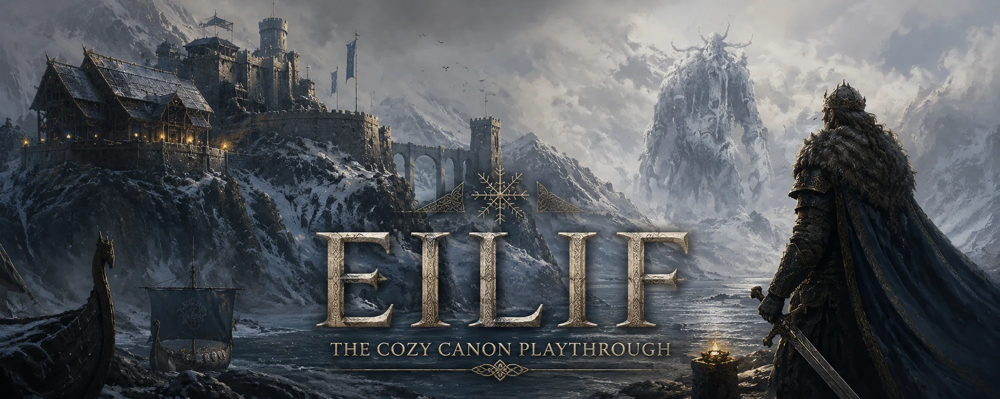

<p align="center">
  
</p>

<h1 align="center">⚔ Eilif — The Cozy Canon Playthrough</h1>

<p align="center">
  A community dashboard + Discord integration for a modded Valheim server.<br/>
  <em>Bosses gate progression — no sailing ahead of the longship, vikings.</em>
</p>

<p align="center">
  <a href="https://valheim-dashboard.vercel.app">🌐 Live dashboard</a> ·
  Next.js 16 · React 19 · Tailwind v4 · Supabase · Discord
</p>

---

## What this is

**Eilif** is a modded Valheim dedicated server (GTXGaming). This repo is the whole stack that surrounds it:

| Piece | What it does | Where |
|---|---|---|
| 🖥️ **Dashboard** | Public site: who's online, leaderboards, mods, boss-gated world progress + living roadmap | `app/` → Vercel |
| 🤖 **Discord bot** | Relays joins/deaths/raids to `#server`; first-boss-kill `@everyone` to `#valheim`; 8 AM & 10 PM recaps with a deaths leaderboard + Player-of-the-Day | `services/discord-bot/` |
| 📜 **Log poller** | Tails the server log over SFTP → derives presence/sessions/deaths → dashboard webhook | `services/log-poller/` |
| 📊 **Stats parser** | `ServerCharacters` `.fch` over SFTP → per-player kills / resources / builds / exploration → `player_stats` | `services/stats-parser/` |

```
Valheim server (GTXGaming) ─SFTP─> log poller ──┐
                                                 ├──> /api/webhook ──> Supabase ──> Dashboard (Vercel)
ServerCharacters .fch ─SFTP─> stats parser ──────┘                        │
                                                                          └──> Discord bot ──> #valheim / #server
```

## Dashboard pages
- **Hall** (`/`) — banner hero, server status, who's online, recent saga, boss progress
- **Vikings** (`/players`) — roster, sailing-now, leaderboards
- **World** (`/world`) — boss-kill timeline (progression gates) + roadmap
- **Saga** (`/events`) — filterable event feed
- **Mods** (`/mods`) — installed mods (edit `config/mods.ts`)

## Configure (edit & redeploy)
- `config/server.ts` — server name, tagline, max players, address
- `config/mods.ts` — the mod list shown on the Mods page

## Run locally
> ⚠️ **Node 20+ required** (Next 16). Pinned via `.nvmrc`.
```bash
nvm use && npm install && npm run dev
```

## The services (run on the host, via systemd)
- `services/discord-bot/` — `npm start`; unit: `eilif-discord-bot.service`. Recaps gated until launch via `RECAPS_START`. Mark a boss: `node scripts/mark-boss.js "Bonemass" "Bjorn,Astrid"`.
- `services/log-poller/` — `npm start`; unit: `valheim-log-poller.service`. Parses `BepInEx/LogOutput.log` over SFTP.
- `services/stats-parser/` — `npm run once` / `npm start`; unit: `eilif-stats-parser.service`. Pulls ServerCharacters `.fch` over SFTP → `player_stats`.

## Data model (Supabase)
`players`, `sessions`, `events`, `player_stats`, `bosses`, `roadmap`, `server_status`, `discord_events` — public-read RLS, writes via service role through `/api/webhook`.

## Status
- ✅ Dashboard (5 pages, dark Norse theme) · ✅ Discord bot (live) · ✅ Log poller (built) · ✅ Stats parser (built + validated)
- Services pull over **SFTP** (host: GTXGaming) · server world launches **Sept 9**

---
<p align="center"><em>Sailing the tenth world. May your axes stay sharp. 🛡️</em></p>
